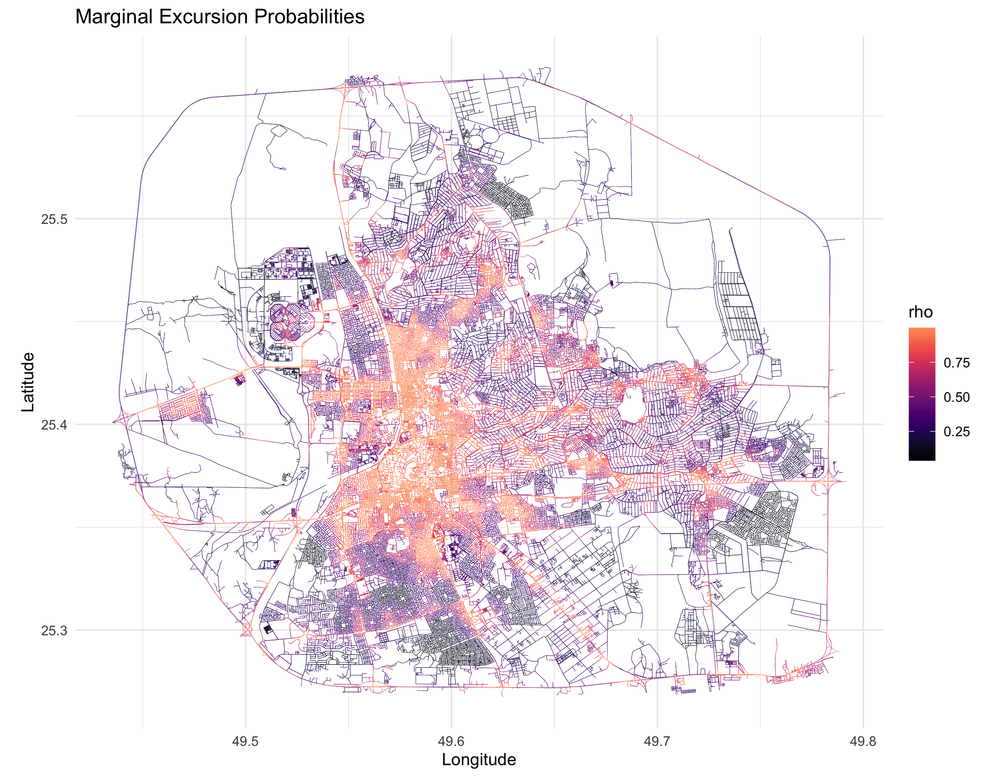
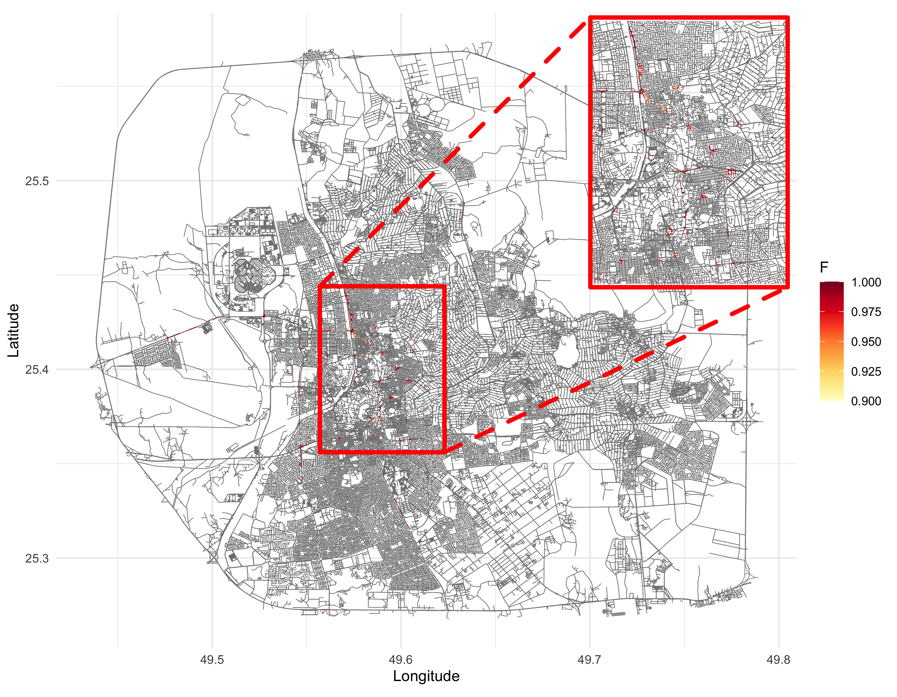
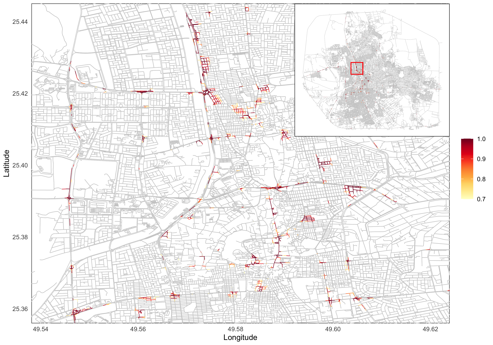

```{r  setup, include=FALSE}
# Set seed for reproducibility
set.seed(42) 
# Set global options for all code chunks
knitr::opts_chunk$set(
  # Disable messages printed by R code chunks
  message = FALSE,    
  # Disable warnings printed by R code chunks
  warning = FALSE,    
  # Show R code within code chunks in output
  echo = TRUE,        
  # Include both R code and its results in output
  include = TRUE,     
  # Evaluate R code chunks
  eval = FALSE,       
  # Enable caching of R code chunks for faster rendering
  cache = FALSE,      
  # Align figures in the center of the output
  fig.align = "center",
  # Enable retina display for high-resolution figures
  retina = 2,
  # Show errors in the output instead of stopping rendering
  error = TRUE,
  # Do not collapse code and output into a single block
  collapse = FALSE
)
```

```{css, echo = FALSE}
body .main-container {
max-width: 100% !important;
width: 100% !important;
}
body {
max-width: 100% !important;
}

body, td {
font-size: 16px;
}
code.r{
font-size: 14px;
}
pre {
font-size: 14px
}
.custom-box {
background-color: #f5f7fa; /* Light grey-blue background */
border-color: #e1e8ed; /* Light border color */
color: #2c3e50; /* Dark text color */
padding: 15px; /* Padding inside the box */
border-radius: 5px; /* Rounded corners */
margin-bottom: 20px; /* Spacing below the box */
}
.caption {
margin: auto;
text-align: center;
margin-bottom: 20px; /* Spacing below the box */
}
```

In this section, we will discuss how to compute the excursion sets of a random field. The excursion sets are the sets of points where the random field exceeds a certain threshold. We will use the `excursions` package in R to compute the excursion sets of a random field.

Note that for large-scale problems, the computation of excursion sets can be computationally expensive. In such cases, it is advisable to use parallel computing or distributed computing to speed up the computation, and/or use CPU clusters with large memory.

## Computing Excursion Sets
```{r}
# Load the required libraries
library(excursions)
library(ggplot2)
library(dplyr)
library(INLA)
library(scico)
library(MetricGraph)
library(qs)

# Function that takes the INLA object and returns the excursions object
compute_excursions <- function(spde_fit_inla, F_limit, alpha, type) {
  start.time <- Sys.time()
  test_exc <- excursions.inla(spde_fit_inla,
                              name = "field", u = 0, type = type,
                              method = "EB",
                              F.limit = F_limit,
                              alpha = alpha,
                              verbose = TRUE,
                              n.iter = 10000,
                              max.threads = 10
  )
  
  end.time <- Sys.time()
  time.taken <- round(end.time - start.time, 2)
  return(list(test_exc, time.taken))
}

load("Data/5Fit_model1_alpha1_exact_100m.RData")

### MODEL 1 ###
exc_model1_larger <- compute_excursions(spde_fit1_no_repl, 0.3, 0.3, ">")

save(exc_model1_larger, file = "Data/5Graph_model1_alpha1_excursions.RData")

#### Plotting the excursions ####
exc_model1_larger <- exc_model1_larger[[1]]

plot_excursions <- function(exc, graph, file_prefix) {
  library(ggplot2)
  library(scico)
  library(MetricGraph)
  library(excursions)
  
  #replace all NA with 0
  exc$F <- replace_na(exc$F, 0)
  p1 <- graph$plot_function(exc$F, vertex_size = 0, edge_width = 0.1) + labs(color = "F")+ theme_minimal()
  png(paste0("Figures/", file_prefix, "_F.png"), width = 3 * 700, height = 3 * 900, res = 300)
  print(p1)
  dev.off()
  
  p2 = graph$plot_function(exc$E, vertex_size = 0, edge_width = 0.1) + labs(title = "Excursion set",color = "E")
  png(paste0("Figures/",file_prefix, "_E.png"), width = 3*700, height = 3*500, res = 300)
  print(p2)
  dev.off()
  
  p3 = graph$plot_function(exc$M, vertex_size = 0, edge_width = 0.1,
                           scale_color = scale_color_scico(palette = "vik", midpoint = 0)) + labs(title = "Contour avoiding set",color = "M")
  png(paste0("Figures/", file_prefix, "_M.png"), width = 3*700, height = 3*500, res = 300)
  print(p3)
  dev.off()

  p4 <- graph$plot_function(exc$rho, vertex_size = 0, edge_width = 0.1) +
    labs(title = "Marginal excursion probabilities", color = "rho") + theme_minimal()
  png(paste0("Figures/", file_prefix, "_rho.png"), width = 3 * 700, height = 3 * 900, res = 300)
  print(p4)
  dev.off()
  
  library(viridis)
  png(paste0("Figures/", file_prefix, "_rho2_.png"), height = 3 * 700, width = 3 * 900, res = 300)
  p4_2 <- graph$plot_function(exc$rho, vertex_size = 0, edge_width = 0.1) +
    scale_color_viridis(option = "C", direction = 1) + 
    labs(title = "Marginal Excursion Probabilities", color = "rho")+ theme_minimal()
  print(p4_2)
  dev.off()
  
  p5 <- graph$plot_function(exc$mean,
                            vertex_size = 0, edge_width = 0.1,
                            scale_color = scale_color_scico(palette = "vik", midpoint = 0)
  ) + labs(title = "Posterior mean", color = "Mean")+ theme_minimal()
  png(paste0("Figures/", file_prefix, "_mean.png"), width = 3 * 700, height = 3 * 900, res = 300)
  print(p5)
  dev.off()
  
  p6 <- graph$plot_function(exc$vars,
                            vertex_size = 0, edge_width = 0.1,
                            scale_color = scale_color_scico(palette = "vik", midpoint = 0)
  ) + labs(title = "Marginal variance", color = "Variance")+ theme_minimal()
  png(paste0("Figures/", file_prefix, "_vars.png"), width = 3 * 700, height = 3 * 900, res = 300)
  print(p6)
  dev.off()
}
library(qs)

plot_excursions(exc_model1_larger, graph, "5Excursions_model2_alpha1")
```

Marginal excursion probabilities for Model 2 are shown in the figure below:

```{r, eval=TRUE, echo=FALSE}
 
```

The excursion set for Model 2 is shown below:
```{r, eval=TRUE, echo=FALSE}
 
```  

The code to plot the figure above:
```{r, eval=FALSE}
library(ggplot2)
library(MetricGraph)
library(excursions)
library(viridis)
library(tidyr)
library(ggmagnify)
library(RColorBrewer)

# Plot with adjusted color scale
p5 <- graph$plot_function(exc$F, vertex_size = 0, edge_width = 0.3) +
  scale_color_gradientn(
    colors = brewer.pal(9, "YlOrRd"),    # Use the YlOrRd palette
    limits = c(0.7, 1),                  # Set desired range
    na.value = "grey80"                  # Optional: handle any remaining NA values
  ) +
  theme_minimal() 
p5

final <- p5 +
  geom_magnify(
    from = c(49.56, 49.58, 25.42, 25.45), # Smaller square for 4x magnification
    to = c(49.705, 49.8, 25.45, 25.58),   # Expanded view coordinates for larger magnification
    colour = "red",
    linewidth = 1,                       # Slightly thicker border
    proj.fill = alpha("red", 0.1),# Increased opacity for fill
  )
final
```

```{r, eval=TRUE, echo=FALSE}
 
```
The code to plot the figure(same as Figure 6 in [paper](https://arxiv.org/abs/2501.18558)) above:
```{r, eval=FALSE}
library(ggplot2)
library(MetricGraph)
library(excursions)
library(viridis)
library(tidyr)
library(ggmagnify)
library(RColorBrewer)
# Plot with adjusted color scale
p5 <- graph$plot_function(exc$F, vertex_size = 0, edge_width = 0.3) +
  scale_color_gradientn(
    colors = brewer.pal(9, "YlOrRd"),    # Use the YlOrRd palette
    limits = c(0.7, 1),                  # Set desired range
    na.value = "grey80"                  # Optional: handle any remaining NA values
  ) +
  theme_minimal() 
p5

# 2. Zoomed-in plot (main focus) #can replot with thicker lines in general
zoomed_plot <- p5 + 
  theme(panel.grid = element_blank()) + # Remove all grid lines
  coord_cartesian(
    xlim = c(49.542, 49.62),  # Align with your first image's longitude range
    ylim = c(25.36, 25.441)   # Align with your first image's latitude range
  ) +
  theme(
    panel.background = element_rect(fill = "white"),  # Ensure no transparent background
    plot.margin = margin(5, 5, 5, 5)
  ) +labs(color = "")

# 3. Full map (for inset) - Simplify the theme
full_map <- p5 +
  theme_void() +  # Remove axes, labels, background
  theme(
    panel.background = element_rect(fill = "white", colour = "black"), # White background + border
    legend.position = "none",  # Remove legend
    panel.border = element_rect(colour = "black", fill = NA, linewidth = 0.5)
  ) + # Add rectangle to show zoomed region on the full map
  geom_rect(
    aes(xmin = 49.56, xmax = 49.59, ymin = 25.41, ymax = 25.44),
    fill = NA, colour ="red", linewidth = 0.5
  )

# 4. Convert the full map to a grob
inset_grob <- ggplotGrob(full_map)

# 5. Combine zoomed plot with inset
reverse_plot <- zoomed_plot +
  annotation_custom(
    grob = inset_grob,
    xmin = 49.590,   # Right edge of zoomed plot (longitude)
    xmax = 49.626,   # Adjust to fit within xlim
    ymin = 25.408,   # Top edge of zoomed plot (latitude)
    ymax = 25.44499    # Adjust to fit within ylim
  )

```

