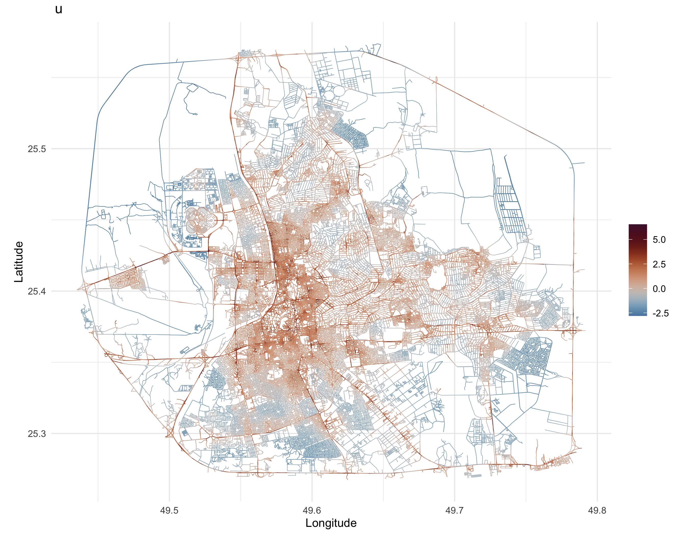
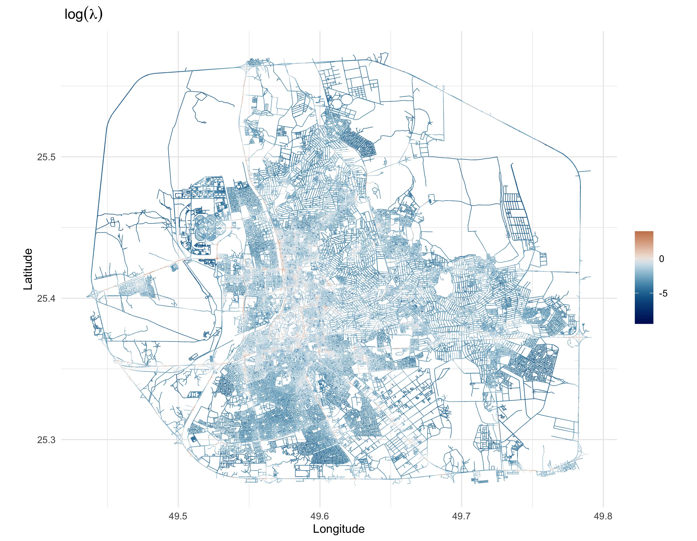

```{r  setup, include=FALSE}
# Set seed for reproducibility
set.seed(42) 
# Set global options for all code chunks
knitr::opts_chunk$set(
  # Disable messages printed by R code chunks
  message = FALSE,    
  # Disable warnings printed by R code chunks
  warning = FALSE,    
  # Show R code within code chunks in output
  echo = TRUE,        
  # Include both R code and its results in output
  include = TRUE,     
  # Evaluate R code chunks
  eval = FALSE,       
  # Enable caching of R code chunks for faster rendering
  cache = FALSE,      
  # Align figures in the center of the output
  fig.align = "center",
  # Enable retina display for high-resolution figures
  retina = 2,
  # Show errors in the output instead of stopping rendering
  error = TRUE,
  # Do not collapse code and output into a single block
  collapse = FALSE
)
```

```{css, echo = FALSE}
body .main-container {
  max-width: 100% !important;
  width: 100% !important;
}
body {
  max-width: 100% !important;
}

body, td {
  font-size: 16px;
}
code.r{
  font-size: 14px;
}
pre {
  font-size: 14px
}
.custom-box {
  background-color: #f5f7fa; /* Light grey-blue background */
    border-color: #e1e8ed; /* Light border color */
    color: #2c3e50; /* Dark text color */
    padding: 15px; /* Padding inside the box */
    border-radius: 5px; /* Rounded corners */
    margin-bottom: 20px; /* Spacing below the box */
}
.caption {
  margin: auto;
  text-align: center;
  margin-bottom: 20px; /* Spacing below the box */
}
```

In this section, we fit **Model 2** as described in the paper, which includes both spatial effects and covariates. The details on the covariates used in the analysis are provided in the [Extracting Covariates](covariates.html)  and  [Computing Spatial Covariates](covariates2.html)  sections.


### Data Loading and Graph Preparation

The next code loads libraries and reads in the datasets, including the spatial graph and mesh covariate information. This lays the foundation for subsequent covariate preparation and model building.

```{r}
library(MetricGraph)
library(INLA)
library(qs)
library(sf)
library(dplyr)
# Load Graph
data <- qread("Data/data_all_reasons_with_distances_7FRC.qs")
graph <- qread("Data/graph_mesh_pruned_100m_7FRC_ver2.qs")
mesh_covariates <- qread("Data/mesh_locations_pruned_100m_with_distances_7FRC_ver2.qs")

# Note that this graph already has the observation to vertex
summary(graph)
```


### Adding Covariates to the Graph

We now add to the graph with a “Length” covariate and extract the data needed for later steps. Note that, the length covariate is computed as the length of the road segment between two vertices. 

```{r}
#####################################
###### Add covariates to graph ######
#####################################

# Create a "Length" covariate
graph$set_edge_weights(weights = graph$get_edge_weights() %>% mutate(Length = graph$get_edge_lengths()))
data_on_graph <- graph$get_data()

# Extract the data
ss <- graph$get_data()
dat <- ss
ind.dat <- graph$PtV # vector with the indices of the vertices which are observation locations.

system.time(graph$compute_fem())
# user  system elapsed 
# 717.227   4.772 719.350 

n_accidents <- sum(!is.na(ss$AccidentSeverityId)) # 2482 - total number of accidents
```
### Preparing and Normalizing Covariates

Before adding integration points, we prepare covariates by computing additional metrics and normalizing them. This section merges graph and mesh data, applies a min–max normalization, and prepares the dataset for model fitting.

```{r}
alpha <- 1
atilde <- graph$mesh$weights

# These are the indices of the mesh nodes which are not observation locations
ind.add <- setdiff(1:length(atilde), ind.dat)

### Prepare covariates to match dimensions ####
data_on_mesh = graph$edgeweight_to_data(mesh = TRUE, add = FALSE, return = TRUE)
data_on_mesh$TrafficIntensity = (data_on_mesh$SpeedLimit / data_on_mesh$FRC) * log(data_on_mesh$Length) # using Chaudhuri et al. (2023) formula

# Use normalized version of variables to compute the intensity!!!

# Merge data_on_mesh with mesh_covariates using the common column edge_number and distance_on_edge
data_on_mesh = merge(data_on_mesh, mesh_covariates, by = c(".edge_number", ".distance_on_edge"))
data_on_mesh = st_as_sf(data_on_mesh, coords = c("x", "y"), crs = 4326)

# Dummify the road type - one hot encoding of FRC
library(spatstat)
road_types_graph_data_dummy = as.data.frame(dummify(as.factor(data_on_graph$FRC)))
colnames(road_types_graph_data_dummy) = c( "FRC1", "FRC2", "FRC3", "FRC4", "FRC5", "FRC6", "FRC7")
road_types_graph_mesh_dummy = as.data.frame(dummify(as.factor(data_on_mesh$FRC)))
colnames(road_types_graph_mesh_dummy) = c("FRC1", "FRC2", "FRC3", "FRC4", "FRC5", "FRC6", "FRC7")

YearNew = unique(data_on_graph$YearNew)
n_accidents = table(data_on_graph$YearNew)


# Perform min_max normalization of all covariates
min_max_normalize <- function(x) {
  return( (x - min(x))/(max(x) - min(x)) )
}

# List of columns to normalize, including count-based covariates
columns_to_normalize <- c("Length", "SpeedLimit", "TrafficIntensity", "FRC", 
                          "distance_to_mosque", "distance_to_education", "distance_to_finance", "distance_to_hospital",
                          "distance_to_intersection", 
                          "exp_decay_distance_to_mosque", "exp_decay_distance_to_education", "exp_decay_distance_to_finance",
                          "exp_decay_distance_to_hospital", "exp_decay_distance_to_intersection",
                          "inv_distance_to_mosque", "inv_distance_to_education", "inv_distance_to_finance",
                          "inv_distance_to_hospital", "inv_distance_to_intersection",
                          "log_distance_to_finance", "log_distance_to_hospital", "log_distance_to_intersection",
                          "log_distance_to_mosque", "log_distance_to_education",
                          "inv_sqrt_distance_to_intersection", "inv_sqrt_distance_to_mosque", "inv_sqrt_distance_to_education",
                          "inv_sqrt_distance_to_finance", "inv_sqrt_distance_to_hospital",
                          "exp_decay_double_distance_to_mosque", "exp_decay_double_distance_to_education", "exp_decay_double_distance_to_finance",
                          "exp_decay_double_distance_to_hospital", "exp_decay_double_distance_to_intersection")

# Apply normalization for all the data (merge for this purpose only)
graph_data <- data_on_graph[, columns_to_normalize]
mesh_data <- data_on_mesh[, columns_to_normalize]

# Drop geometry column
library(dplyr)
combined_data <- bind_rows(graph_data, mesh_data) %>% select(-geometry)

# Apply normalization
normalized_combined_data <- combined_data %>%
  mutate(across(everything(), min_max_normalize))

# Split data back
normalized_graph_data <- normalized_combined_data[1:nrow(graph_data), ]
normalized_mesh_data <- normalized_combined_data[(nrow(graph_data) + 1):nrow(combined_data), ]

# Assign normalized values back to original dataframes
data_on_graph[, columns_to_normalize] <- normalized_graph_data
data_on_mesh[, columns_to_normalize] <- normalized_mesh_data
```

### Adding Observations to the Graph

This section adds the observed locations and integration points into the graph. The observed points are enriched with the covariates from the graph data while the integration points use the corresponding mesh data.

```{r}
atilde <- graph$mesh$weights

graph$clear_observations()
# Add the locations which are observed
graph$add_observations(
  data = data.frame(
    y = rep(1, length(ind.dat)),
    e = atilde[ind.dat],
    Length = data_on_graph$Length,
    SpeedLimit = data_on_graph$SpeedLimit,
    FRC1 = road_types_graph_data_dummy$FRC1,
    FRC2 = road_types_graph_data_dummy$FRC2,
    FRC3 = road_types_graph_data_dummy$FRC3,
    FRC4 = road_types_graph_data_dummy$FRC4,
    FRC5 = road_types_graph_data_dummy$FRC5,
    FRC6 = road_types_graph_data_dummy$FRC6,
    FRC7 = road_types_graph_data_dummy$FRC7,
    TrafficIntensity = data_on_graph$TrafficIntensity,
    exp_dist_mosque = data_on_graph$exp_decay_distance_to_mosque,
    exp_dist_education = data_on_graph$exp_decay_distance_to_education,
    exp_dist_finance = data_on_graph$exp_decay_distance_to_finance,
    exp_dist_hospital = data_on_graph$exp_decay_distance_to_hospital,
    exp_dist_intersection = data_on_graph$exp_decay_distance_to_intersection,
    exp_double_dist_mosque = data_on_graph$exp_decay_double_distance_to_mosque,
    exp_double_dist_education = data_on_graph$exp_decay_double_distance_to_education,
    exp_double_dist_finance = data_on_graph$exp_decay_double_distance_to_finance,
    exp_double_dist_hospital = data_on_graph$exp_decay_double_distance_to_hospital,
    exp_double_dist_intersection = data_on_graph$exp_decay_double_distance_to_intersection,
    log_dist_mosque = data_on_graph$log_distance_to_mosque,
    log_dist_education = data_on_graph$log_distance_to_education,
    log_dist_finance = data_on_graph$log_distance_to_finance,
    log_dist_hospital = data_on_graph$log_distance_to_hospital,
    log_dist_intersection = data_on_graph$log_distance_to_intersection,
    inv_sqrt_dist_mosque = data_on_graph$inv_sqrt_distance_to_mosque,
    inv_sqrt_dist_education = data_on_graph$inv_sqrt_distance_to_education,
    inv_sqrt_dist_finance = data_on_graph$inv_sqrt_distance_to_finance,
    inv_sqrt_dist_hospital = data_on_graph$inv_sqrt_distance_to_hospital,
    inv_sqrt_dist_intersection = data_on_graph$inv_sqrt_distance_to_intersection,
    edge_number = data_on_graph$.edge_number,
    distance_on_edge = data_on_graph$.distance_on_edge
  ),
  normalized = TRUE
)

# Subset the data_on_mesh to include correct indices
data_on_mesh_copy = data_on_mesh
data_on_mesh = data_on_mesh[ind.add,]
road_types_graph_mesh_dummy_copy = road_types_graph_mesh_dummy
road_types_graph_mesh_dummy = road_types_graph_mesh_dummy[ind.add,]


# Add the remaining integration points
graph$add_observations(
  data = data.frame(
    y = rep(0, length(ind.add)),
    e = atilde[ind.add],
    Length = data_on_mesh$Length,
    SpeedLimit = data_on_mesh$SpeedLimit,
    FRC1 = road_types_graph_mesh_dummy$FRC1,
    FRC2 = road_types_graph_mesh_dummy$FRC2,
    FRC3 = road_types_graph_mesh_dummy$FRC3,
    FRC4 = road_types_graph_mesh_dummy$FRC4,
    FRC5 = road_types_graph_mesh_dummy$FRC5,
    FRC6 = road_types_graph_mesh_dummy$FRC6,
    FRC7 = road_types_graph_mesh_dummy$FRC7,                                      
    TrafficIntensity = data_on_mesh$TrafficIntensity,
    exp_dist_mosque = data_on_mesh$exp_decay_distance_to_mosque,
    exp_dist_education = data_on_mesh$exp_decay_distance_to_education,
    exp_dist_finance = data_on_mesh$exp_decay_distance_to_finance,
    exp_dist_hospital = data_on_mesh$exp_decay_distance_to_hospital,
    exp_dist_intersection = data_on_mesh$exp_decay_distance_to_intersection,
    exp_double_dist_mosque = data_on_mesh$exp_decay_double_distance_to_mosque,
    exp_double_dist_education = data_on_mesh$exp_decay_double_distance_to_education,
    exp_double_dist_finance = data_on_mesh$exp_decay_double_distance_to_finance,
    exp_double_dist_hospital = data_on_mesh$exp_decay_double_distance_to_hospital,
    exp_double_dist_intersection = data_on_mesh$exp_decay_double_distance_to_intersection,
    log_dist_mosque = data_on_mesh$log_distance_to_mosque,
    log_dist_education = data_on_mesh$log_distance_to_education,
    log_dist_finance = data_on_mesh$log_distance_to_finance,
    log_dist_hospital = data_on_mesh$log_distance_to_hospital,
    log_dist_intersection = data_on_mesh$log_distance_to_intersection,
    inv_sqrt_dist_mosque = data_on_mesh$inv_sqrt_distance_to_mosque,
    inv_sqrt_dist_education = data_on_mesh$inv_sqrt_distance_to_education,
    inv_sqrt_dist_finance = data_on_mesh$inv_sqrt_distance_to_finance,
    inv_sqrt_dist_hospital = data_on_mesh$inv_sqrt_distance_to_hospital,
    inv_sqrt_dist_intersection = data_on_mesh$inv_sqrt_distance_to_intersection,
    edge_number = graph$mesh$VtE[ind.add, 1],
    distance_on_edge = graph$mesh$VtE[ind.add, 2]
  ),
  normalized = TRUE
)
```

### Exploratory Correlation Analysis

Before modeling, we check the correlation among covariates. The following code produces several correlation plots to help decide which variables to include.

```{r}
df = graph$get_data()
# CHECK CORRELATION before fitting the model
png("Figures/4Corrplot_model3_all.png", height = 10, width = 10, units = "in", res = 300)
corrplot::corrplot(cor(data_rep[,c(3:32)]), method = "color", type = "upper")
dev.off()

# exp_double_dist
corrplot::corrplot(cor(data_rep[,c(3:10, 12,18:22)]), method = "color",addCoef.col = "black", type = "upper")

png("Figures/4Corrplot_model3_exp_double_dist.png", height = 10, width = 10, units = "in", res = 300)
corrplot::corrplot(cor(data_rep[,c(3,5:10, 12,18:22)]), method = "color",addCoef.col = "black", type = "upper")
dev.off()

# exp_dist
# excluded finance due to high correlation with other variables >=0.5
png("Figures/4Corrplot_model3_exp_dist.png", height = 10, width = 10, units = "in", res = 300)
corrplot::corrplot(cor(data_rep[,c(3:10,12:17)]), method = "color",addCoef.col = "black", type = "upper")
dev.off()

# log_dist - highly correlated with all other distance variables. FUllY excluded
png("Figures/4Corrplot_model3_log_dist.png", height = 10, width = 10, units = "in", res = 300)
corrplot::corrplot(cor(data_rep[,c(3:10,12,23:27)]), method = "color",addCoef.col = "black", type = "upper")
dev.off()

# inv_sqrt_dist
png("Figures/4Corrplot_model3_inv_sqrt_dist.png", height = 10, width = 10, units = "in", res = 300)
corrplot::corrplot(cor(data_rep[,c(3:10,12,28:32)]), method = "color",addCoef.col = "black", type = "upper")
dev.off()
```

### Building the SPDE Model

Next, we create the SPDE model using the graph object with covariates. The code here sets up the necessary spatial model structure that will later be incorporated into the INLA stacks.
```{r}
system.time(spde_model2 <- graph_spde(graph, alpha = alpha, parameterization = "spde", verbose = 1))
data_spde2 <- graph_data_spde(graph_spde = spde_model2, name = "field")
```

### Fitting Multiple Model Formulations

We now form the INLA stack and fit several models with different covariate formulations. This part demonstrates alternative model specifications, allowing for later comparison of their performance.

```{r}
##########################
###### Fit model #########
##########################
data_on_mesh = data_on_mesh_copy
# Form INLA stack object
stk2 <- inla.stack(
  data = data_spde[["data"]],
  A = data_spde[["basis"]],
  effects = c(
    data_spde[["index"]],
    list(Intercept = 1,
         road_type1 = road_types_graph_mesh_dummy$FRC1,
         road_type2 = road_types_graph_mesh_dummy$FRC2,
         road_type3 = road_types_graph_mesh_dummy$FRC3,
         road_type4 = road_types_graph_mesh_dummy$FRC4,
         road_type5 = road_types_graph_mesh_dummy$FRC5,
         road_type6 = road_types_graph_mesh_dummy$FRC6,
         length  = data_on_mesh$Length,
         speed_limit =data_on_mesh$SpeedLimit,
         intensity = data_on_mesh$TrafficIntensity,
         dist_mosque = data_on_mesh$exp_decay_distance_to_mosque,
         dist_education = data_on_mesh$exp_decay_distance_to_education, 
         dist_finance = data_on_mesh$exp_decay_distance_to_finance, 
         dist_hospital = data_on_mesh$exp_decay_distance_to_hospital,
         dist_intersection = data_on_mesh$exp_decay_distance_to_intersection, 
         dist_double_mosque = data_on_mesh$exp_decay_double_distance_to_mosque, 
         dist_double_education = data_on_mesh$exp_decay_double_distance_to_education, 
         dist_double_finance = data_on_mesh$exp_decay_double_distance_to_finance, 
         dist_double_hospital = data_on_mesh$exp_decay_double_distance_to_hospital, 
         dist_double_intersection = data_on_mesh$exp_decay_double_distance_to_intersection, 
         invsqrt_dist_mosque = data_on_mesh$inv_sqrt_distance_to_mosque, 
         invsqrt_dist_education = data_on_mesh$inv_sqrt_distance_to_education, 
         invsqrt_dist_finance = data_on_mesh$inv_sqrt_distance_to_finance, 
         invsqrt_dist_hospital = data_on_mesh$inv_sqrt_distance_to_hospital, 
         invsqrt_dist_intersection = data_on_mesh$inv_sqrt_distance_to_intersection
    )
  ),
  tag = "data"
)

# Fit a series of models with various covariate combinations
# Model 1 as described in paper 
spde_fit2_1 <- inla(y ~ -1 + Intercept + f(field, model = spde_model2),
                   family = "poisson", data = inla.stack.data(stk2),
                   control.predictor = list(A = inla.stack.A(stk2)),
                   control.compute = list(config = TRUE),
                   E = inla.stack.data(stk2)$e
 )
# Only intensity
spde_fit2_2 <- inla(y ~ -1 + Intercept + intensity + f(field, model = spde_model2),
            family = "poisson", data = inla.stack.data(stk2),
            control.predictor = list(A = inla.stack.A(stk2)),
            control.compute = list(config = TRUE),
            E = inla.stack.data(stk2)$e
)
# Speed limit and length
spde_fit2_3 <- inla(y ~ -1 + Intercept + speed_limit + length +f(field, model = spde_model2),
                    family = "poisson", data = inla.stack.data(stk2),
                    control.predictor = list(A = inla.stack.A(stk2)),
                    control.compute = list(config = TRUE),
                    E = inla.stack.data(stk2)$e
)

# Intensity and road type m
#removed road_type2 as it was not significant according to the 95% CI
spde_fit2_4 <- inla(y ~ -1 + Intercept + intensity + road_type1 + road_type2+
                      road_type3 + road_type4 + road_type5 + road_type6 +
                      f(field, model = spde_model2),
                    family = "poisson", data = inla.stack.data(stk2),
                    control.predictor = list(A = inla.stack.A(stk2)),
                    control.compute = list(config = TRUE),
                    E = inla.stack.data(stk2)$e
)
# Full model
spde_fit2_5 <- inla(y ~ -1 + Intercept + intensity + road_type1 +
                      road_type2 + road_type3 + road_type4 + road_type5 + road_type6 +
                      dist_mosque + dist_education + dist_finance +
                      dist_hospital + dist_intersection + f(field, model = spde_model2),
                    family = "poisson", data = inla.stack.data(stk2),
                    control.predictor = list(A = inla.stack.A(stk2)),
                    control.compute = list(config = TRUE),
                    E = inla.stack.data(stk2)$e)
spde_fit2_5_2 <- inla(y ~ -1 + Intercept + intensity + road_type1 +
                      road_type3 + road_type4 + road_type5 + road_type6 +
                       dist_education + dist_finance +
                      dist_hospital  + f(field, model = spde_model2),
                    family = "poisson", data = inla.stack.data(stk2),
                    control.predictor = list(A = inla.stack.A(stk2)),
                    control.compute = list(config = TRUE),
                    E = inla.stack.data(stk2)$e)

# Full model with different distance metrics
spde_fit2_6 <- inla(y ~ -1 + Intercept + intensity + road_type1 +
                      road_type2 + road_type3 + road_type4 + road_type5 + road_type6 +
                      dist_double_mosque + dist_double_education + dist_double_finance +
                      dist_double_hospital + dist_double_intersection + f(field, model = spde_model2),
                    family = "poisson", data = inla.stack.data(stk2),
                    control.predictor = list(A = inla.stack.A(stk2)),
                    control.compute = list(config = TRUE),
                    E = inla.stack.data(stk2)$e)
spde_fit2_6_2 <- inla(y ~ -1 + Intercept + intensity + road_type1 +
                        road_type3 + road_type4 + road_type5 + road_type6 +
                        dist_double_education + dist_double_finance +
                        dist_double_hospital +  f(field, model = spde_model2),
                      family = "poisson", data = inla.stack.data(stk2),
                      control.predictor = list(A = inla.stack.A(stk2)),
                      control.compute = list(config = TRUE),
                      E = inla.stack.data(stk2)$e)

spde_fit2_7 <- inla(y ~ -1 + Intercept + intensity + road_type1 +
                      road_type2 + road_type3 + road_type4 + road_type5 + road_type6 +
                      invsqrt_dist_mosque + invsqrt_dist_education + invsqrt_dist_finance +
                      invsqrt_dist_hospital + invsqrt_dist_intersection + f(field, model = spde_model2),
                    family = "poisson", data = inla.stack.data(stk2),
                    control.predictor = list(A = inla.stack.A(stk2)),
                    control.compute = list(config = TRUE),
                    E = inla.stack.data(stk2)$e)

spde_fit2_7_2 <- inla(y ~ -1 + Intercept + intensity + road_type1 +
                      road_type3 + road_type4 + road_type5 + road_type6 +
                      invsqrt_dist_education + invsqrt_dist_finance +
                      f(field, model = spde_model2),
                    family = "poisson", data = inla.stack.data(stk2),
                    control.predictor = list(A = inla.stack.A(stk2)),
                    control.compute = list(config = TRUE),
                    E = inla.stack.data(stk2)$e)

```

### Visualizing Credible Intervals

For each model we extract the 95% credible intervals of key covariates. The following loop produces simple interval plots to assess significance.

```{r}
plotCredibleInterval <- function(spde_fit) {
  # Extract the intervals
  intervals <- spde_fit$summary.fixed[c(3,5)]
  df <- data.frame(
    Parameter = rownames(intervals),
    Lower = intervals[, "0.025quant"],
    Upper = intervals[, "0.975quant"]
  )
  # Add a new column that checks if the interval includes 0
  df$IncludesZero <- df$Lower * df$Upper <= 0
  p <- ggplot(df, aes(x = Parameter, y = 0, color = IncludesZero)) +
    geom_errorbar(aes(ymin = Lower, ymax = Upper), width = 0.2) +
    geom_vline(xintercept = 0, linetype = "dashed") +
    scale_color_manual(values = c("TRUE" = "black", "FALSE" = "red")) +
    theme_minimal() +
    ylab("Value") +
    xlab("Parameter") +
    ggtitle("95% Credible Interval") +
    theme(legend.position = "none")
  print(p)
}

# Plot the credible intervals
for (i in 1:7){
  plotCredibleInterval(get(paste0("spde_fit2_", i)))
}

# After analysing and removing the not significant covariates 
for (i in 5:7){
  plotCredibleInterval(get(paste0("spde_fit2_", i, "_2")))
}


# A table of results for the different models to compare the mean parameters of kappa and tau
# to extract mean = c(spde_result$summary.kappa$mean,spde_result$summary.tau$mean)

df_mean = data.frame(
  Model = c("Model 1", "Model 2", "Model 3", "Model 4", "Model 5", "Model 6", "Model 7"),
  kappa = c(0.000, 0.000, 0.000, 0.000, 0.000, 0.000, 0.000),
  tau = c(0.000, 0.000, 0.000, 0.000, 0.000, 0.000, 0.000)
)
for (i in 1:7) {
  spde_result <- spde_metric_graph_result(get(paste0("spde_fit2_", i)), "field", spde_model2)
  df_mean$kappa[i] <- spde_result$summary.kappa$mean
  df_mean$tau[i] <- spde_result$summary.tau$mean
}
# Plot the results
plot(df_mean$kappa, df_mean$tau, xlab = "kappa", ylab = "tau", main = "Model Comparison")
```

### Extracting and Plotting Final Model Results

We now extract the results from our chosen final model (`spde_fit2_5`), compute parameter summaries, and visualize the posterior distributions. This final block also includes saving plots of the spatial intensity and latent field.

```{r}

spde_result <- spde_metric_graph_result(spde_fit2_5, "field", spde_model2)
round(spde_result$summary.kappa,3)
fit_result5 = summary(spde_fit2_5)
fit_result5

alpha <- 1
nu <- alpha - 0.5
kappa <- sqrt(8 * nu) / range
tau <- sqrt(gamma(nu) / (sigma^2 * gamma(alpha) * sqrt(4 * pi) * kappa^(2 * nu)))

# For "spde" parameterization
result_df <- data.frame(
  parameter = c("kappa", "tau"),
  mean = c(
    spde_result$summary.kappa$mean,
    spde_result$summary.tau$mean
  ),
  mode = c(
    spde_result$summary.kappa$mode,
    spde_result$summary.tau$mode
  )
)
print(result_df)


# For "matern" parameterization
result_df <- data.frame(
  parameter = c("sigma", "range"),
  rspde_version = c(sigma, range),
  mean_exact = c(
    spde_result$summary.sigma$mean,
    spde_result$summary.range$mean
  ),
  mode_exact = c(
    spde_result$summary.sigma$mode,
    spde_result$summary.range$mode
  )
)
print(result_df)

# Plotting the posterior distribution of the parameters
library(ggplot2)
posterior_df_fit <- gg_df(spde_result)
ggplot(posterior_df_fit) +
 geom_line(aes(x = x, y = y)) +
 facet_wrap(~parameter, scales = "free") +
 labs(y = "Density")
  
```
### Plotting and Saving Spatial Outputs

Finally, we plot and save various spatial outputs (intensity maps and latent field plots). 
```{r}
###### Extracting results ######
# summary.random - contains the posterior mean of the unstructured random effect, u(s)
# summary.fitted.values - contains the predicted intensity (mean number of events per unit area), lambda
# summary.linear.predictor - contains the posterior mean of the linear predictor, log(lambda)

library(scico)
library(gridExtra)
library(ggplot2)
library(gridExtra)
library(viridis)
library(RColorBrewer)
 # Function to plot and save results
plot_and_save_results <- function(fit_object, graph, stk, file_prefix) {
   # Extracting intensity results
   index <- inla.stack.index(stk, tag = "data")$effect
   lambda_mean <- fit_object$summary.fitted.values[index, "mean"]

   #### Intensity Plot Variations ####

   # Colormap 1: vik with white background (scico + theme_minimal)
   png(paste0(file_prefix, "_intensity_vik_minimal.png"), height = 3 * 700, width = 3 * 900, res = 300)
   p_vik_minimal <- graph$plot_function(X = exp(lambda_mean), vertex_size = 0, edge_width = 0.2, scale_color = scale_color_scico(palette = "vik", midpoint = 0, begin = 0.1)) +
     ggtitle(expression(paste(lambda, ", intensity"))) +
     theme_minimal()
   print(p_vik_minimal)
   dev.off()

   # Colormap 2: viridis
   png(paste0(file_prefix, "_intensity_viridis.png"), height = 3 * 700, width = 3 * 900, res = 300)
   p_viridis <- graph$plot_function(X = exp(lambda_mean), vertex_size = 0, edge_width = 0.2, scale_color = scale_color_viridis(option = "D", direction = 1)) +
     ggtitle(expression(paste(lambda, ", intensity"))) + theme_minimal()
   print(p_viridis)
   dev.off()

   # Colormap 4: plasma (viridis)
   png(paste0(file_prefix, "_intensity_plasma.png"), height = 3 * 700, width = 3 * 900, res = 300)
   p_plasma <- graph$plot_function(X = exp(lambda_mean), vertex_size = 0, edge_width = 0.2, scale_color = scale_color_viridis(option = "plasma", direction = 1)) +
     ggtitle(expression(paste(lambda, ", intensity"))) + theme_minimal()
   print(p_plasma)
   dev.off()
   
   #### Latent Field Plot Variations ####
   u_posterior_mean <- fit_object$summary.random$field[["mean"]]
  
   png(paste0(file_prefix, "_posterior_u_vikO.png"), height = 3 * 700, width = 3 * 900, res = 300)
   p1 <- graph$plot_function(X = u_posterior_mean, vertex_size = 0, edge_width = 0.2, scale_color = scale_color_scico(palette = "vikO", midpoint = 0)) +
     ggtitle(expression(~u)) + theme_minimal()
   print(p1)
   dev.off()

   
   # #### Log-Intensity Plot ####
   
   png(paste0(file_prefix, "_log_intensity2.png"), height = 3 * 700, width = 3 * 900, res = 300)
   p32 <- graph$plot_function(X = log_lambda, vertex_size = 0, edge_width = 0.2, scale_color = scale_color_scico(palette = "vik", midpoint = 0)) +
     ggtitle(expression(~ log(lambda))) + theme_minimal()
   print(p32)
   dev.off()
 }
 plot_and_save_results(spde_fit2_5, graph, stk2, "Figures/5Graph_model2_alpha1_7FRC_pruned_exact_100m_ver5")
 
```


The model results are visualized in the following plots:
1. **Latent Field Plot Variations**:
```{r, eval=TRUE, echo=FALSE}
 

```  

2. **Log-Intensity Plot**:
```{r, eval=TRUE, echo=FALSE}
 
```  

